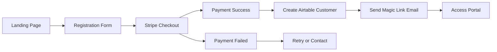

# Customer Registration & Onboarding Flow

## Overview
Complete flow from landing page visitor to active portal user.

## Architecture



## Detailed Flow

### 1. Landing Page (Marketing Site)
**Location**: Could be separate or at root domain
**Content**:
- Service explanation
- Pricing plans ($199/$299/$349)
- Value proposition
- Social proof/testimonials
- CTA: "Get Started" / "Register Now"

### 2. Registration Form
**Required Fields**:
```javascript
{
  // Personal Info
  firstName: string,
  lastName: string,
  email: string,
  phone: string,
  
  // CRITICAL: Service Address
  streetAddress: string,
  unit: string, // optional
  city: string,
  state: string,
  zipCode: string,
  
  // Plan Selection
  plan: 'starter' | 'medium' | 'family',
  
  // Optional
  referralCode?: string,
  buildingProperty?: string
}
```

### 3. Stripe Checkout Integration
**Setup Fees**:
- Starter: $99.50
- Medium: $149.50
- Family: $174.50

**Process**:
1. Create Stripe Checkout Session
2. Include metadata (email, plan, etc.)
3. Redirect to Stripe hosted checkout
4. Handle success/cancel callbacks

### 4. Post-Payment Processing

#### On Stripe Success Webhook:
```javascript
async function handleCheckoutSuccess(session) {
  // 1. Extract customer data from session metadata
  const customerData = session.metadata;
  
  // 2. Create Stripe Customer
  const stripeCustomer = await stripe.customers.create({
    email: customerData.email,
    name: `${customerData.firstName} ${customerData.lastName}`,
    phone: customerData.phone,
    address: {
      line1: customerData.streetAddress,
      line2: customerData.unit,
      city: customerData.city,
      state: customerData.state,
      postal_code: customerData.zipCode
    }
  });
  
  // 3. Create Airtable Customer Record
  const airtableCustomer = await airtable.create('Customers', {
    'First Name': customerData.firstName,
    'Last Name': customerData.lastName,
    'Email': customerData.email,
    'Phone': customerData.phone,
    'Street Address': customerData.streetAddress,
    'Unit/Apt': customerData.unit,
    'City': customerData.city,
    'State': customerData.state,
    'ZIP Code': customerData.zipCode,
    'Monthly Plan': customerData.plan,
    'Stripe Customer ID': stripeCustomer.id,
    'Stripe Setup Payment ID': session.payment_intent,
    'Setup Fee Paid': 'Yes',
    'Account Status': 'Active',
    'Account Created Date': new Date()
  });
  
  // 4. Generate Magic Link
  const magicLink = await generateMagicLink(customerData.email);
  
  // 5. Send Welcome Email with Magic Link
  await sendWelcomeEmail({
    to: customerData.email,
    firstName: customerData.firstName,
    magicLink: magicLink,
    plan: customerData.plan
  });
  
  // 6. Schedule First Contact (optional)
  await scheduleOnboardingCall(airtableCustomer.id);
}
```

### 5. Magic Link Authentication

**Implementation Options**:

#### Option A: Token-based
```javascript
// Generate token
const token = crypto.randomBytes(32).toString('hex');
const expires = Date.now() + 3600000; // 1 hour

// Store in Airtable or Redis
await storeToken(email, token, expires);

// Send link
const magicLink = `https://portal.mystoragevalet.com/auth/magic?token=${token}&email=${email}`;
```

#### Option B: Using existing session system
```javascript
// Create session directly
const sessionId = await createSession(customerId);
const magicLink = `https://portal.mystoragevalet.com/auth/session/${sessionId}`;
```

### 6. Portal Access
**On Magic Link Click**:
1. Verify token/session
2. Create user session
3. Redirect to portal dashboard
4. Show onboarding wizard (first-time users)

## Implementation Priorities

### Phase 1: MVP Registration (Week 1)
- [ ] Basic landing page
- [ ] Registration form with all fields
- [ ] Stripe Checkout integration
- [ ] Create Airtable customer
- [ ] Basic email with login credentials

### Phase 2: Magic Link (Week 2)
- [ ] Implement magic link generation
- [ ] Update email templates
- [ ] Handle magic link authentication
- [ ] Session creation

### Phase 3: Polish (Week 3)
- [ ] Better landing page design
- [ ] Form validation
- [ ] Error handling
- [ ] Success/failure pages
- [ ] Onboarding wizard in portal

## Technical Decisions Needed

1. **Landing Page Location**:
   - Subdomain: `www.mystoragevalet.com` (landing) vs `portal.mystoragevalet.com`
   - OR same domain with routes: `/` (landing) vs `/portal`

2. **Magic Link Storage**:
   - Airtable (simple, one less system)
   - Redis (faster, more scalable)
   - In-memory (simplest for MVP)

3. **Email Service**:
   - Continue with Gmail (current)
   - Upgrade to SendGrid (better for scale)

4. **Form Builder**:
   - Custom React form
   - Typeform/JotForm embed
   - Stripe Payment Links (simplest)

## Environment Variables Needed

```env
# Stripe Webhook Secret
STRIPE_WEBHOOK_SECRET=whsec_xxxxx

# Magic Link Secret
MAGIC_LINK_SECRET=random_secret_key

# Portal URL
PORTAL_URL=https://portal.mystoragevalet.com
```

## Testing Checklist

- [ ] Complete registration flow
- [ ] Payment processes correctly
- [ ] Airtable customer created
- [ ] Stripe customer created
- [ ] Magic link email received
- [ ] Magic link logs user in
- [ ] Session persists
- [ ] Portal accessible

## Security Considerations

1. **Magic Links**:
   - Expire after 1 hour
   - Single use only
   - Secure random generation
   - HTTPS only

2. **Data Validation**:
   - Sanitize all inputs
   - Validate email format
   - Check for existing customers
   - Prevent duplicate payments

3. **Stripe Webhooks**:
   - Verify webhook signatures
   - Idempotency handling
   - Retry logic

## Support for Edge Cases

1. **Payment fails**: 
   - Retry payment
   - Contact support option
   
2. **Email doesn't arrive**:
   - Resend magic link option
   - Alternative login method

3. **Existing customer tries to register**:
   - Detect by email
   - Redirect to login
   - Send magic link instead