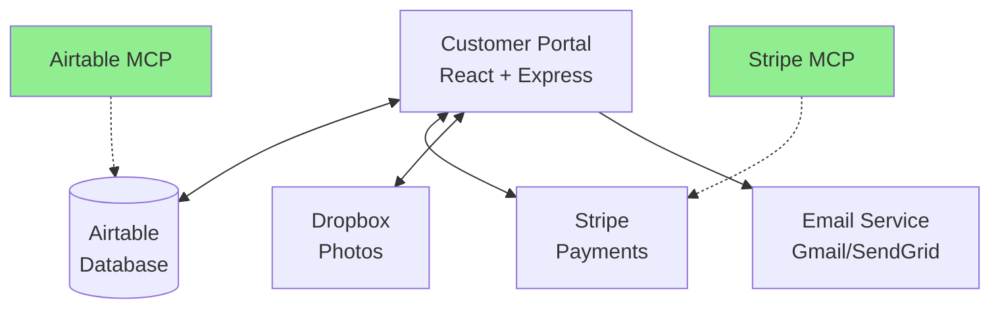

# System Integration Map - Storage Valet Portal

## Connected Systems Overview



## Integration Points

### 1. Airtable ↔ Portal
- **Primary Database**: All customer, container, movement data
- **Session Store**: Authentication sessions
- **MCP Access**: ✅ Direct queries via Airtable MCP

### 2. Stripe ↔ Portal
- **Payment Processing**: Subscriptions, setup fees
- **Customer Sync**: Stripe Customer ID stored in Airtable
- **MCP Access**: ✅ Direct queries via Stripe MCP

### 3. Cross-System Data Flow

#### Customer Registration Flow
1. User signs up in Portal
2. Create Airtable Customer record
3. Create Stripe Customer
4. Store Stripe ID in Airtable
5. Process setup fee
6. Create Stripe Subscription
7. Store Subscription ID in Airtable

#### Data Synchronization Points
| Airtable Field | Stripe Field | Sync Method |
|---------------|--------------|-------------|
| Customer Email | customer.email | On creation |
| Stripe Customer ID | customer.id | Stored in Airtable |
| Stripe Subscription ID | subscription.id | Stored in Airtable |
| Account Status | subscription.status | Manual sync needed |
| Monthly Plan | price.id | Maps to product |

### 4. MCP Benefits

#### Without MCP (Before)
- Portal → API → Airtable
- Portal → API → Stripe
- No direct cross-verification
- Debugging requires multiple tools

#### With MCP (Now)
- Direct access to both systems
- Real-time cross-verification
- Instant data validation
- Single interface for all systems

## Testing Cross-System Integration

### Test 1: Customer Data Consistency
```
1. Query Airtable: Get customer by email
2. Query Stripe: Get customer by same email
3. Verify: Stripe Customer ID matches Airtable record
```

### Test 2: Subscription Status
```
1. Query Airtable: Get Stripe Subscription ID
2. Query Stripe: Get subscription details
3. Verify: Status, price, current period match
```

### Test 3: Payment History
```
1. Query Stripe: List charges for customer
2. Query Airtable: Check First Pickup Date
3. Verify: Billing started after first movement
```

## Missing Integrations

### Currently Manual
- Subscription status updates
- Payment failure handling
- Invoice reconciliation

### Recommended Automations
1. **Stripe Webhooks** → Update Airtable on:
   - subscription.updated
   - invoice.payment_failed
   - customer.updated

2. **Airtable Automations** → Trigger on:
   - First movement scheduled → Start billing
   - Account status change → Update Stripe

3. **MCP Monitoring** → Regular checks:
   - Daily sync verification
   - Orphaned records detection
   - Payment/subscription alignment

## Security Considerations

### API Keys
- Airtable: Personal Access Token (PAT)
- Stripe: Secret Key (Live/Test modes)
- Both stored in Claude Desktop config
- Never commit to version control

### Access Patterns
- Portal: Full read/write via API
- MCP: Configured for appropriate access
- Webhooks: Verify signatures

## Next Steps

1. ✅ Airtable MCP configured
2. ✅ Stripe MCP configured
3. ⏳ Test cross-system queries
4. ⏳ Implement webhook handlers
5. ⏳ Create sync verification scripts
6. ⏳ Add monitoring/alerting