# Softr Integration Setup Guide

## 🔗 **Softr Webhook Configuration**

### **Step 1: Webhook Endpoints**

Configure these webhooks in your Softr app:

```bash
# Customer Registration (Required)
POST https://portal.mystoragevalet.com/api/softr/customer-created

# Plan Updates (Optional)
POST https://portal.mystoragevalet.com/api/softr/plan-updated

# Payment Updates (Optional)
POST https://portal.mystoragevalet.com/api/softr/payment-updated

# Health Check (Testing)
GET https://portal.mystoragevalet.com/api/softr/health
```

### **Step 2: Webhook Security**

Generate a secure webhook secret:

```bash
# Generate webhook secret
openssl rand -hex 32

# Add to Vercel environment variables
vercel env add SOFTR_WEBHOOK_SECRET [your-generated-secret]
```

### **Step 3: Webhook Headers**

Configure Softr to send these headers:

```json
{
  "Content-Type": "application/json",
  "X-Softr-Signature": "sha256=[computed-signature]"
}
```

## 📋 **Softr Form Configuration**

### **Customer Registration Form Fields**

Map these Softr form fields to send the correct data:

```javascript
// Required fields for portal account creation
{
  "email": "customer_email",           // User's email address
  "firstName": "first_name",           // First name
  "lastName": "last_name",             // Last name
  "phone": "phone_number",             // Phone number
  "address": "street_address",         // Street address
  "city": "city",                      // City
  "state": "state",                    // State/Province
  "zip": "zip_code",                   // ZIP/Postal code
  "plan": "selected_plan",             // starter|medium|family
  "promoCode": "promo_code",           // Promo code (if any)
  "stripeCustomerId": "stripe_customer_id", // From Stripe integration
  "setupFeePaid": "setup_fee_paid"     // true|false
}
```

### **Softr Webhook Payload Example**

```json
{
  "id": "softr_user_123",
  "email": "customer@example.com",
  "firstName": "John",
  "lastName": "Doe",
  "phone": "+1-555-0123",
  "address": "123 Main St",
  "city": "San Francisco",
  "state": "CA",
  "zip": "94105",
  "plan": "family",
  "promoCode": "WELCOME50",
  "stripeCustomerId": "cus_abc123",
  "setupFeePaid": "true",
  "timestamp": "2025-08-03T10:30:00Z"
}
```

## 🔄 **Integration Flow**

### **Customer Registration Process**

```mermaid
graph LR
A[Customer visits Softr] --> B[Fills registration form]
B --> C[Stripe payment]
C --> D[Softr webhook → Portal]
D --> E[Portal account created]
E --> F[Welcome email sent]
F --> G[Customer logs into portal]
```



### **Detailed Flow Steps**

**1. Customer Registration on Softr:**

- Customer fills out registration form
- Selects plan (starter/medium/family)
- Enters payment information
- Applies promo code (if any)

**2. Payment Processing:**

- Softr handles Stripe payment
- Setup fee charged immediately
- Stripe customer and subscription created

**3. Webhook to Portal:**

- Softr sends webhook to portal
- Portal creates user account
- Temporary password generated
- Welcome email sent with portal access

**4. Portal Access:**

- Customer receives email with portal link
- Can immediately log in and start using services
- First pickup can be scheduled

## 🛠️ **Softr App Configuration**

### **Database Fields in Softr**

Create these fields in your Softr Airtable integration:

```bash
# Customer table fields
- Email (Single line text)
- First Name (Single line text)
- Last Name (Single line text)
- Phone (Phone number)
- Address (Single line text)
- City (Single line text)
- State (Single select)
- ZIP Code (Single line text)
- Plan (Single select: starter, medium, family)
- Promo Code (Single line text)
- Stripe Customer ID (Single line text)
- Setup Fee Paid (Checkbox)
- Portal Access Granted (Checkbox) - Auto-filled by webhook
- Registration Date (Date)
```

### **Softr Page Structure**

```
www.mystoragevalet.com/
├── / (Landing page)
├── /pricing (Plans and pricing)
├── /signup (Registration form)
├── /payment (Stripe payment)
├── /success (Registration success)
└── /portal-access (Redirect to portal)
```

## 🔐 **Security Configuration**

### **Webhook Authentication**

```javascript
// Softr webhook configuration
{
  "url": "https://portal.mystoragevalet.com/api/softr/customer-created",
  "method": "POST",
  "headers": {
    "Content-Type": "application/json",
    "X-Softr-Signature": "{{webhook_signature}}"
  },
  "secret": "[your-webhook-secret]"
}
```

### **CORS Configuration**

Add to your Vercel deployment:

```javascript
// server/index.ts - Add CORS for Softr
app.use(
  cors({
    origin: [
      "https://www.mystoragevalet.com",
      "https://mystoragevalet.com",
      "https://portal.mystoragevalet.com",
    ],
    credentials: true,
  })
);
```

## 📧 **Email Templates**

### **Welcome Email (Sent by Portal)**

The portal automatically sends this email when a customer registers via Softr:

```html
Subject: 🚀 Your Storage Valet Portal is Ready! Your Storage Valet customer portal is now ready!
Portal Access: - URL: https://portal.mystoragevalet.com - Email: [customer-email] - Temporary
Password: [generated-password] Next Steps: 1. Log into your portal 2. Change your password 3. Add
your first items 4. Schedule your pickup Welcome to Storage Valet!
```

## 🧪 **Testing Integration**

### **Test Webhook Locally**

```bash
# Use ngrok to test webhooks locally
ngrok http 3000

# Test webhook endpoint
curl -X POST https://[ngrok-url]/api/softr/customer-created \
  -H "Content-Type: application/json" \
  -H "X-Softr-Signature: sha256=[test-signature]" \
  -d '{
    "email": "test@example.com",
    "firstName": "Test",
    "lastName": "User",
    "plan": "starter",
    "setupFeePaid": "true"
  }'
```

### **Test Complete Flow**

1. ✅ Register customer via Softr form
2. ✅ Verify webhook received in portal logs
3. ✅ Check customer account created in Airtable
4. ✅ Verify welcome email sent
5. ✅ Test portal login with provided credentials
6. ✅ Confirm customer can access dashboard

## 📊 **Monitoring & Analytics**

### **Webhook Monitoring**

```javascript
// Add to your monitoring dashboard
const webhookMetrics = {
  total_received: 0,
  successful_processed: 0,
  failed_processing: 0,
  average_response_time: 0,
};

// Log all webhook events
console.log("Softr webhook received:", {
  type: "customer-created",
  email: customerData.email,
  timestamp: new Date(),
  success: true,
});
```

### **Success Metrics**

Track these key metrics:

- ✅ Webhook delivery success rate (>99%)
- ✅ Customer account creation success rate (>99%)
- ✅ Welcome email delivery rate (>95%)
- ✅ Customer portal login rate within 24h (>80%)

## 🔧 **Troubleshooting**

### **Common Issues**

**Webhook Not Received:**

```bash
# Check Vercel function logs
vercel logs --follow

# Verify webhook URL is correct
curl https://portal.mystoragevalet.com/api/softr/health
```

**Customer Account Not Created:**

```bash
# Check Airtable API credentials
vercel env ls | grep AIRTABLE

# Test Airtable connection
npm run schema:test
```

**Welcome Email Not Sent:**

```bash
# Check email service configuration
vercel env ls | grep GMAIL

# Test email service
# (Add test endpoint in development)
```

## 🚀 **Go Live Checklist**

Before launching with Softr integration:

- [ ] Vercel deployment is live at portal.mystoragevalet.com
- [ ] All environment variables are set in Vercel
- [ ] Webhook endpoints return 200 status
- [ ] Airtable integration is working
- [ ] Email service is configured and tested
- [ ] Softr webhook secret is configured
- [ ] Test customer registration flow end-to-end
- [ ] Monitor webhook logs for first 24 hours

Your Softr + Portal integration is now ready for production! 🎉
